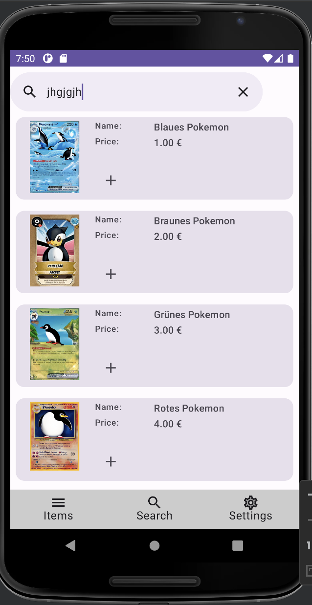

= TCGWatcher App

== Description
The TCGWatcher App is an Android application designed to facilitate the search and exploration of Pokemon cards available on the internet. The app provides users with an intuitive interface to search for specific Pokemon cards, view their details, and save their favorite cards for future reference. Whether you're a seasoned collector or a casual enthusiast, this app makes it easy to discover and track your favorite Pokemon cards.

== Features
* **Search:** Quickly find specific Pokemon cards by name. The results are cached and a search history is available.
* **User-Friendly Interface:** Enjoy a clean and intuitive interface designed for easy navigation and seamless user experience.
* **Quicksearch** While typing a fuzzy search is made to guess the desired card name.
* **View Details:** Get detailed information about each Pokemon card, including its attributes, abilities, and rarity.

== Benefits
* **No-Account** No need to create an account or register anything. Just use the app.
* **Ad-Free** This app is free of any kind of Ads or other commercial interests.
* **No-Tracking / No-Logs** This app does not contain any user or traffic tracking. No statistics or anything like that. The app does not have a backend.
* **OSS** Its free like free speech. Completely http://github.com/HaVonTe1[open source].

== Planed Features
* **Search:** Quickly find specific all kind of collectable cards (Magic the Gathering, Yugioh, One Piece etc...) by name, type, rarity, or any other relevant criteria.
* **Save Favorites:** Save your favorite Pokemon cards to a personalized collection for easy access later.
* **Offline Mode:** Access your saved favorite cards even when you're offline.
* **Price Checker** Mark specific Cards or Products for a background check of price changes and get a notification in such a case.

== Installation
Currently the project is in pre-alpha phase. So no releases yet.
I am planning to make APK releases here in github and I will try to add the app the fdroid store.

== Usage
1. Open the app on your Android device.
2. Use the search bar to look for specific Pokemon cards by name,
3. Browse through the search results and tap on a card to view its details.

== Contributing
We welcome contributions to improve and enhance the  App. If you'd like to contribute, please follow these steps:
1. Fork the repository.
2. Make your changes and improvements.
3. Submit a pull request outlining the changes you've made and the problem or feature your changes address.
4. Your contribution will be reviewed, and if accepted, merged into the main codebase.

== License
This project is licensed under the MIT License - see the LICENSE.md file for details.

